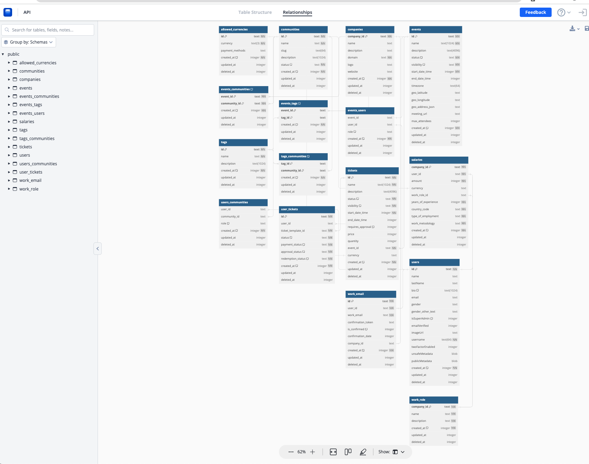

# Como Ejecutar el proyecto

- Asegurate de tener el archivo .dev.vars (Pídele al equipo los valores correspondientes.)
  - Puedes correr una BDD local si te parece.
  - Para correr el proyecto con las BDD de desarrollo, tienes que agregar un archivo `.dev.vars` con los valores de las mismas.
- Crear una base de datos en turso.tech
  - Instala el CLI de turso [acá](https://github.com/tursodatabase/turso-cli)
  - Authentícate con `turso auth login`
  - Crea una base de datos con `turso db create NOMBRE_DE_TU_BDD`
  - Obten la TOKEN de tu DB con `turso db tokens create NOMBRE_DE_TU_BDD`
  - Obten la URL de tu DB con `turso db tokens list`
  - Guarda la URL de tu BDD y la token en el archivo .dev.vars bajo `DATABASE_URL` y `DATABASE_TOKEN`
- Finalmente, `npm i` & `num run dev`
- Listo! Tu servidor GraphQL está corriendo en http://127.0.0.1:8787

# Cómo ver el esquema de la BDD?

El esquema de la BDD se genera corriendo `npm run db:model` y se puede visualizar en https://dbdiagram.io

La documentación de nuestro modelo está en https://dbdocs.io/fforres/API?view=relationships
(O haz click en la imagen)

<a href="https://dbdocs.io/fforres/API?view=relationships">
  
</a>

  <!--  -->

# Cómo escribir tests

> PSA: Los tests se corren con `npm run tests` (o `npm run test:interactive` si quieres explorar una UI con mas informacion)

## Preparación del entorno de prueba

> La expectativa de nuestros tests, es que cada archivo de tests pueda correr en paralelo (y aislados) el uno del otro.
> Por lo mismo, creamos una base de datos nueva antes de correr cada test.
> Para asegurarte de que esto tambien ocurra entre tests del mismo archivo, recuerda poner en tu archivo de tests,
> un hook `afterEach` que limpie la base de datos.
> (En nuestros ejemplos, usamos la función clearDatabase() en el hook afterEach() para lograr esto.)

## Escribir la query o mutación

(Ejemplos [en esta carpeta](https://github.com/JSConfCL/gql_api/blob/main/src/tests/user))
Define la query o mutation GraphQL que quieres que tu resolver maneje en un archivo `.gql`.
Por ejemplo

```graphql
query getUsers {
  users {
    id
    name
    email
  }
}
```

## Generar código

Para poder correr los test, necesitamos tener funciones y variables en JavaScript/Typescript, no en "graphql".
Podríamos escribir la query o mutación, como un string, directamente en un archivo `.ts`. Pero eso es tedioso, propenso a errores, y no nos da autocompletado.

Para evitar esto, usamos un generador de código, que nos permite escribir la query o mutación en un archivo `.gql`, y luego generar el código asociado a esta operación de graphql.

Usaremos el archivo `.gql` que creamos recien, y correremos el comando `npm run generate`.

Esto generará codigo y tipos asociados a esta operación de graphql, por ejemplo, la query que definimos arriba, generará el siguiente archivo:

```typescript
/* eslint-disable */
/* @ts-nocheck */
/* prettier-ignore */
/* This file is automatically generated using `npm run graphql:types` */
import type * as Types from '../../generated/types';

import type { JsonObject } from "type-fest";
import gql from "graphql-tag";
export type GetUsersQueryVariables = Types.Exact<{ [key: string]: never }>;

export type GetUsersQuery = {
  __typename?: "Query";
  users: Array<{
    __typename?: "User";
    id: string;
    name: string | null;
    email: string | null;
  }>;
};

export const GetUsers = gql`
  query getUsers {
    users {
      id
      name
      email
    }
  }
`;
```

## Escribir el test

En nuestro caso, usamos vitest. Tu test debe ejecutar la consulta o mutación usando, y luego verificar que la respuesta sea la esperada. Aquí hay un ejemplo:

```TS
describe("My Resolver Tests", () => {
  it("Should return the correct data", async () => {
    // Acá irá el codigo del test
  });
});
```

## Inserta data en tu BDD

Usa (o crea) métodos en [./src/tests/\_\_fixtures/index.ts](./src/tests/__fixtures/index.ts) para pre-popular tu BDD.

Por ejemplo:

```TS
import { insertUser } from "~/tests/__fixtures";
describe("My Resolver Tests", () => {
  it("Should return the correct data", async () => {
    const user = await insertUser();
    const user2 = await insertUser({ email: "email@especifico.com" });
  });
});
```

## Ejecuta tu query o mutación.

Tenemos un helper para realizar esto, llamado `executeGraphqlOperation`.
Donde puedes pasar la operación que definiste en el parametro `"document"`.
La query y tipos los debes traer desde tu archivo generado.

Por ejemplo:

> 🚨🚨 IMPORTANTE 🚨🚨
> `executeGraphqlOperation` puede recibir genéricos de typescript para hacer más facil escribir tests, recuerda pasarlos.

```TS
import { insertUser, executeGraphqlOperation } from "~/tests/__fixtures";
import {
  GetUsers,
  GetUsersQuery,
  GetUsersQueryVariables,
} from "~/tests/user/getUsers.generated";

describe("My Resolver Tests", () => {
  it("Should return the correct data", async () => {
    const user = await insertUser();
    const user2 = await insertUser({ email: "email@especifico.com" });
    const response = await executeGraphqlOperation<
      GetUsersQuery,
      GetUsersQueryVariables,
    >({
      document: GetUsers,
    });
  });
});
```

## Ejecuta tu query o mutación con otro usuario.

`executeGraphqlOperation` executa la query o mutación de manera anónima.
Para poder executar una query o mutación con un usuario específico, puedes usar el helper `executeGraphqlOperationAsUser`.
Este helper requiere que ademas de un documento/variables, le pases un usuario. como segundo parámetro.

Por ejemplo:

```TSX
const user1 = await insertUser();
const response = await executeGraphqlOperationAsUser<
  CreateEventMutation,
  CreateEventMutationVariables
>(
  {
    document: SOME_DOCUMENT,
    variables: SOME_VARIABLES,
  },
  user1,
);
```

> De igual manera, tenemos el helper `executeGraphqlOperationAsAdmin` para ejecutar queries o mutaciones como un admin.
> Es un helper similar a `executeGraphqlOperationAsUser`, con la salvedad que no requiere que le pases un usuario como segundo parámetro, y lo crea por ti.

## Verifica tus respuestas:

Puedes usar métodos assert o expect de [Vitest](https://vitest.dev/api/expect.html)

```TS
import { insertUser. executeGraphqlOperation } from "~/tests/__fixtures";
import {
  GetUsers,
  GetUsersQuery,
  GetUsersQueryVariables,
} from "~/tests/user/getUsers.generated";

describe("My Resolver Tests", () => {
  it("Should return the correct data", async () => {
    const user = await insertUser();
    const user2 = await insertUser({ email: "email@especifico.com" });
    const response = await executeGraphqlOperation<
      GetUsersQuery,
      GetUsersQueryVariables,
    >({
      document: GetUsers,
    });
    assert.equal(response.errors, undefined);
    assert.equal(response.data?.users.length, 2);
    assert.equal(response.data?.users[0].id, user.id);
    assert.equal(response.data?.users[1].id, user2.id);
  });
});

```

### Manejo de errores

Además de verificar que tu resolver devuelve los datos correctos, verifica cómo maneja los errores.
Por ejemplo, puedes escribir un test que pase datos incorrectos a tu mutación y luego verificar que la respuesta contiene el error correcto, o que falla donde debería fallar 😀.

# Migraciones

Nuestra BDD es `turso` en produccion/qa y development, usando `libsql` en local.
Usamos `drizzle` y `drizzle-kit` para manejar conexiones a la BDD, que genera automaticamente archivos de migraciones cuando cambias tus modelos, lo que hace muchisimo más facil es escribrlas.

## Cómo escribir migraciones?

### 1. Actualiza el esquema de la base de datos.

> AKA. Crea o edita Tablas, Columnas, Indices, etc.

Primero, necesitas actualizar el archivo del esquema en `./src/datasources/db/schema/tables.ts`. (o )
Este archivo define la estructura de las tablas en la BDD.

> Las relaciones entre tablas, se definen en `./src/datasources/db/schema/relations.ts`.
> Los esquemas de query/update se definen en `./src/datasources/db/schema/CRUD.ts`.

Para definir una tabla, utilizas la función `pgTable()`, donde el primer argumento es el nombre de la tabla y el segundo es un objeto que define los campos de la tabla.

Por ejemplo:

```TS
export const usersSchema = pgTable("users", {
  id: text("id").unique().notNull(),
  name: text("name"),
  bio: text("bio", { length: 1024 }),
  // ...
});
```

Esto define una tabla users con varios campos, incluyendo id, name, y bio.
Los campos se definen utilizando funciones como text() e integer(), y se pueden agregar opciones adicionales, como unique(), notNull(), y default().

### 2. Genera los archivos de migración.

Una vez que hayas actualizado el esquema, debes generar los archivos de migración. Para hacerlo, ejecuta `npx db:generate`.

### 3. Verifica las migraciones:

Antes de ejecutar las migraciones, verifica que están funcionando correctamente.
Puedes hacer esto corriendo todos los tests. Estos geeneran una BDD desde 0, y corren todas las migraciones antes de correr los tests.

### 4. Ejecuta las migraciones:

Finalmente, ejecuta las migraciones con `npm run db:migrate`.
Estos comandos utilizan las variables de entorno definidas en el archivo .dev.vars para conectarse a las BDD de desarrollo.

### 5. Como limpiar tu base de datos:

- conectate a tu bdd con `turso db shell NOMBRE_DE_TU_BDD`
- ejecuta `select 'drop table ' || name || ';' from sqlite_master where type = 'table';` para obtener todas las tablas de tu bdd
  - Esto te devolverá un resultado como el siguiente:
    ```txt
    drop table users;
    drop table events;
    drop table event_attendees;
    drop table event_invitations;
    drop table event_invitation_tokens;
    ```
- copia y pega el resultado en tu terminal para eliminar todas las tablas de tu bdd.
- sal de la shell con `.quit`
- Listo! Tu bdd está 100% limpia. 😊

# Requisitos

- Tener un archivo `.dev.vars` con el siguiente contenido
  ```txt
  DATABASE_URL="PREGUNTALE AL EQUIPO POR ESTO"
  DATABASE_TOKEN="PREGUNTALE AL EQUIPO POR ESTO"
  CLERK_PEM_PUBLIC_KEY="PREGUNTALE AL EQUIPO POR ESTO"
  CLERK_ISSUER_ID="PREGUNTALE AL EQUIPO POR ESTO"
  ```

> BRO-TIP 🔥
> Agrega una variable `ENFORCED_JWT_TOKEN` a tu archivo `.dev.vars`, para utilizarla por defecto en graphiql.

# STACK

- Turso:
  Una BDD on-edge, que usa libsql (un fork de sqlite) lo que nos entrega velocidad en producción, y nos permite correr tests en paralelo facilmente.

- GraphQL Yoga:
  Un servidor GraphQL fácil de configurar que se apoya en Express.js. Proporciona una forma sencilla de crear servidores GraphQL que se pueden conectar a cualquier fuente de datos.

- Zod:
  Una biblioteca de validación y análisis de datos para JavaScript y TypeScript. Se utiliza para definir y validar esquemas de datos.

- Drizzle:
  Un query builder para TypeScript. Ayuda a interactuar con bases de datos SQLite de una manera más estructurada y segura. Además de ayudarnos a crear migraciones incrementales facilmente.

- Cloudflare Workers:
  Una plataforma de servidor ...sin servidor 😊 Que permite ejecutar código en la red de distribución de contenido (CDN) de Cloudflare, lo que permite respuestas más rápidas y menor latencia al ejecutar código cerca del usuario final​1.
